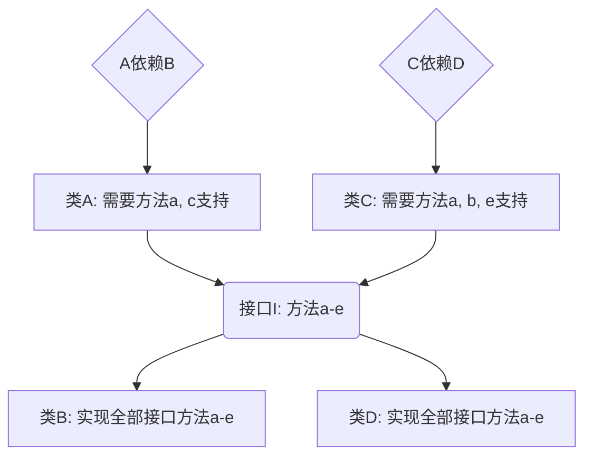
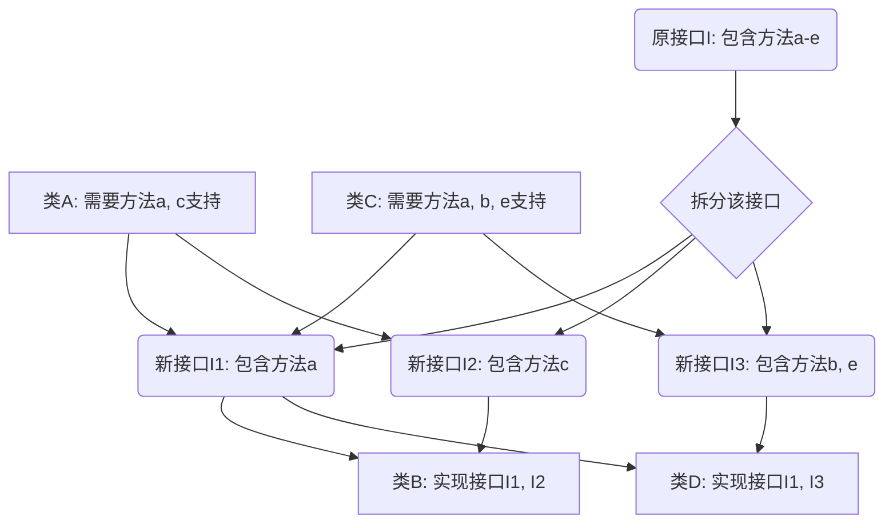

# 单一职责原则 
##### 定义：不要多于一个导致类/方法变更的因素，即一个类/方法只负责一个职责
+ 如下代码体现了单一职责原则的含义 

```java
public class mammal {
 public void eat() {
  System.out.println(“mammal eat.”);
 }
}

public class fish {
 public void eat() {
  System.out.println(“fish eat”);
 }
}
```
+ P.S. 单一职责原则可以被违背，当且仅当：
 1. 类中逻辑足够简单时可以在类的层次上违背；
 2. 类中方法足够少且方法逻辑不复杂时可以在方法的层次上违背。
+ 单一职责原则的优点：  
 1. 降低类的复杂度，使类的逻辑简单
 2. 提高代码可读性和可维护性
 3. 降低变更代码所带来的风险  
+ 单一职责原则不仅适用于OOM，也适用于所有模块化编程。

------


# 里氏替换原则 
首先提出问题：若现阶段已有用A类完成的功能P，要加入新功能P1使得功能P扩充为功能P2，如何解决？  
> 问题的关键在于：如何保证添加P1后不影响P原有的功能？  

+ 首先创建类B继承A
+ 在B中添加新方法从而使功能扩充  
这两个步骤是常规做法，下面给出里氏替换原则的定义： 

##### 定义：    

> 1. 若对于所有类型为T1的对象O1，均有类型为T2的对象O2，使得在某一段引用了O1的程序中的O1全部替换为O2而不引起该程序段功能变化，则称T2为T1的子类型； 

> 2. 程序中所有引用基类的地方必须能透明的调用其子类的对象。 

**简单来说，对于所有需要通过继承来解决的问题，子类尽量不要重写或重载父类的方法**

+ ***关于继承：继承提高了程序的可复用性和可维护性，但前提是遵循继承中暗含的原则。一旦在一个继承体系中定义了一个父类，实际上是定义了一个体系中的规则，其子类必须默认的遵循这样的规则，而不能随意篡改。***

下面给出一段代码来具体说明里氏替换原则：

```java
class A {
 public int func1(int a, int b) {
  return a + b;
 }
}

class B extends A {
 public int func1(int a, int b) {
  return a - b;
 }
 
 public int func2(int a, int b) {
  return a * b;
 }
}

public class doit {
 public static void main(String[] args) {
  A a = new A();
  B b = new B();
  x1 = a.func1(100, 50);
  x2 = b.func1(100, 50);
  x3 = b.func2(100, 50);
 }
}
```

以上程序段的目的是为了在类A已经实现了加法这个功能的前提下去扩充减法和乘法功能，但是定义B类的程序员违背了里氏替换规则——他在编写减法功能时无意中重写了基类的加法功能。后来的程序员在默认B类遵循了设计模式原则的前提下维护这段代码时，会恼火地发现x2输出的结果是50而非150，因为在B类中重写了A类的加法方法，所以B类中已经不存在加法方法了，这也就是违背了里氏替换原则的后果。

+ 基于此，我们再把里氏替换原则通俗化：*子类可以扩充父类的功能，但不能改变其原有功能*，它包含以下四层含义： 

> 1. 子类可以实现父类的抽象方法，但不能覆盖父类的非抽象方法
> 2. 子类中可以增加自己特有的方法
> 3. 子类重载父类方法时，形参输入要更宽松
> 4. 子类实现父类抽象方法时，返回值输出要更严格

---


# 依赖倒置原则 

##### 定义：高层模块不应依赖低层模块，二者都应依赖其抽象；抽象不应该依赖细节，细节应该依赖其抽象。  
该原则的定义不是很难理解，但我们还是通过提出问题-解决问题的方式来分析，下面提出问题： 

+ 若已有类A依赖类B实现某一功能P，现在要添加类A与新类C之间的依赖关系来实现新功能P1，如何操作？ 

可以看出在如上所述的关系中，类A是实现业务逻辑的高级模块，类B和类C则是实现原子操作的底层模块，当我们直接着手添加A与C之间的关系时，必须要大动干戈的修改更为复杂的A类，甚至可能影响到其他功能的正常运行。

+ 解决方案：添加接口I，B和C分别实现接口I，A通过接口I间接与B和C建立依赖关系。

下面给出一个具体场景：我要出去玩，出行方式是坐公交车，考虑到单一职责原则，很显然可以用两个类来实现：

```java
class Bus {
    public String letsGo() {
        return "我坐公交车出去玩";
    }
}

class Me {
    public void play(Bus bus){
        System.out.println("我想出去玩");
        System.out.println(bus.letsGo());
    }
}

public class DoIt {
    public static void main(String[] args) {
        Me me = new Me();
        me.play(new Bus());
    }
}
```

+ 运行结果：

  > 我想出去玩
  >
  > 我坐公交车出去玩

  

  下面延续这个场景，有一天公交车突然停运了，但是我还想出去玩，就只能坐地铁了，这时候自然而然的想到了添加一个叫 *Subway* 的新类，如下所示：

  ```java
  class Subway {
      public String letsGo() {
          return "我坐地铁出去玩";
      }
  }
  ```

  这时候问题就出现了，在已存在的 *Me* 类中，play方法并不能接收 *Subway* 这个新类作为参数，“我”居然不会坐地铁出去玩，这真是太搞笑了。这时候该怎么办？添加一个play的重载方法？那以后我要是坐火车，坐飞机，走路去呢？你会发现 *Me* 类变得无比笨重，维护起来也很麻烦。

  + 接下来，我们提供一个正确的解决办法：添加接口 *Transport* ，把 **出行方式** 这个公共的要素提取出来作为接口方法：

  ```java
  interface Transport {
      public String letsGo();
  }
  ```

  这样就降低了 *Me* 类与具体的交通工具类的耦合度，接口 *Transport* 与 *Me*类发生依赖关系，而其他交通工具类直接实现该接口就可以，下面给出剩余代码：

  ``` java
  class Bus implements Transport {
      public String letsGo() {
          return "我坐公交车出去玩";
      }
  }
  
  class Subway implements Transport {
      public String letsGo() {
          return "我坐地铁出去玩";
      }
  }
  
  class Me {
      public void play(Transport trans) {
          System.out.println("我想出去玩");
          System.out.println(trans.letsGo());
      }
  }
  
  public class DoIt {
      public static void main(String[] args) {
          Me me = new Me();
          me.play(new Bus());
          me.play(new Subway());
      }
  }
  ```

  + 输出结果为：

  >我想出去玩
  >
  >我坐公交车出去玩
  >
  >我想出去玩
  >
  >我坐地铁出去玩

  

  这样，就满足了依赖倒置原则。上例只是一个简单的例子，实际开发中，*Me* 类往往是逻辑复杂的高层业务模块，直接修改带来的风险极大，若遵守依赖倒置原则，就不需要修改高层模块，而只需要修改低层原子操作，项目越大，参与开发的人越多，这项原则带来的好处就越明显。TDD开发模式就是实际中最成功的应用。

  + ***传递依赖关系有三种方式（Spring框架中大量使用）*** 

  > 1. 接口传递（上例中所使用的方式）
  > 2. 构造方法传递（继承关系）
  > 3. setter方法传递 

  + ***实际编程中，有三点注意事项***

  > 1. 底层模块尽量都要有抽象类和接口，或者两者兼具；
  > 2. 变量的声明类型尽量是抽象类或者接口；
  > 3. 使用继承时遵循里氏替换原则。

  *P.S. 依赖倒置原则的核心就是面向接口编程*

---

# 接口隔离原则 

##### 定义：客户端不应该依赖他不需要的接口，一个类对另一个类的依赖应该建立在最小的接口上。

这个原则相对来说比较直接易懂，假设我有一个大型接口 *I*，里面含有方法a-e，现在有一些类需要通过该接口建立依赖关系（见依赖倒置原则），那么实现接口方法的类就必须要实现 *I* 中的全部方法，而不管那些方法是否能在相应的高层模块中用的上，这样的设计未免显得过于臃肿，于是，我们采取把大接口化成小接口的方法，避免无谓的浪费。下面用图示法来说明该原则。

+ **拆分接口前：B类和D类臃肿，包含大量无效代码**



---

+ **拆分接口后：B类和D类不再需要实现无用接口，提高了程序的可读性和可维护性**



---

接口隔离原则的宗旨很简单：永远不要试图用一个接口解决所有问题，而要试图为每个类提供专用接口。分散定义多个接口可以预防外来变更影响到程序本身的运行，提高系统的灵活性和可维护性。

+ 单一职责原则和接口隔离原则的区别：

> 1. 单一职责原则规定的层次是功能的层次，而接口隔离原则规定的层次是接口的层次，首先需要满足单一职责原则，其次才要满足接口隔离原则；
> 2. 单一职责原则约束的是具体的实现类，接口隔离原则约束的是抽象的整体框架。

+ 实际操作中：有四条注意事项：

> 1. 接口尽量小，但是要适度。接口小型化会导致其数量增多，过多的借口会使程序设计和开发复杂化；
> 2. 为依赖接口的类定制服务，只暴露给调用它的类所需要的方法而隐藏其他细节。只有专注为一个模块定制服务，才能建立最小的依赖关系；
> 3. 提高内聚，减少对外交互，使接口用最少的方法完成最多的事；
> 4. 提前设计和规划接口，让每个接口都大小适度，才能准确地实现这一原则。
>
> 

---

# 迪米特法则 

##### 定义：一个对象应该对其他的对象保持最少的了解。

简要来说，迪米特法则规定了一个对象或者说一个类和其他对象或类的耦合度，一个对象或类应当关联他所能关联的最少的对象或类。当存在关系 *A -> B -> C* 时，类 *C* 要尽量通过类 *B* 来关联类 *A* ，而不是直接与类 *A* 发生关联。 

+ 迪米特法则十分简洁明了，但是在使用的时候也要注意适度，可以想象，如果要在一个庞大的系统里避免一个类与其他类进行交互，势必会产生大量中间类，反而增加了复杂度。迪米特法则之所以存在，是为了维持程序设计中高内聚低耦合的规则，但是如果因此提升了系统复杂度，就要考虑在某些逻辑不复杂的地方放弃该原则。

---

# 开闭原则

##### 定义：一个软件实体如类，模块或函数应该对扩展开放，对修改关闭。

相对于以上的六条原则，开闭原则显得过于抽象，而且没有具体的例子能够说明该原则。通俗来讲，开闭原则规定了我们面对程序变化、维护和升级时的行为：我们要尽可能地扩展软件实体的功能来实现变化，而不是修改已有的代码来实现变化。

+ 比起一项独立的原则，开闭原则更像是一个平均分，只要其他五项原则遵守的好，这项平均分自然就会高，你永远不能特意去遵守这项原则，它只是代表你程序规范度的一项得分而已。

---

# 总结

> 1. 六项原则维持着一个共同的宗旨：用抽象构建框架，用实现扩展细节；
> 2. 原则并非死命令，一切以降低程序复杂度和维护成本为核心；
> 3. 应该在设计和架构的环节应用上述原则，先斩后奏不可取。